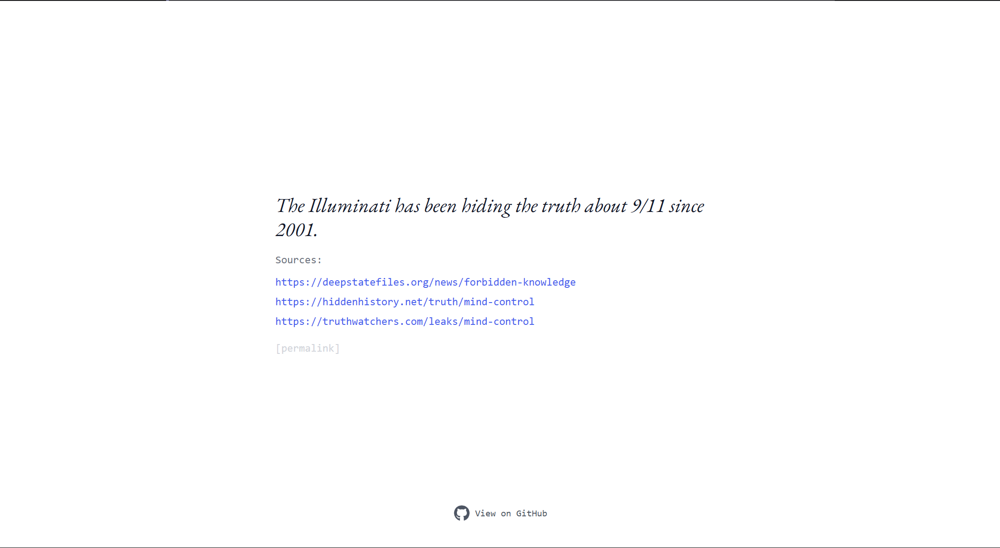
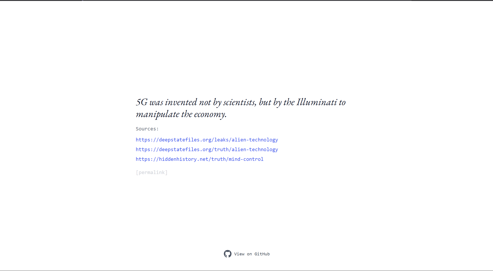

# 🌀 The Mandela Machine

The Mandela Machine is a website that generates **random conspiracy theories** every time you visit. Each conspiracy is accompanied by **fake supporting sources** and a **permalink** to share with others.

## 🚀 Live Demo
🔗 [The Mandela Machine](https://mandela-machine.vercel.app/)

## 📸 Screenshots



## ✨ Features
- **Generate Conspiracies**: A new theory appears every time you visit.
- **Permalinks**: Share specific conspiracies with friends.
- **Fake Sources**: Adds credibility (or chaos) to each conspiracy.
- **Minimalist UI**: Clean and distraction-free interface.

## 🛠️ Tech Stack
### **Frontend** (Vite + React + TailwindCSS)
- React + TypeScript
- Vite for fast development
- TailwindCSS for styling
- Axios for API requests

### **Backend** (FastAPI + SQLite)
- FastAPI for high-performance API
- SQLite for lightweight storage
- Faker library to generate random conspiracies

## 🌀 How Conspiracies Are Created  

Look, I could have used some fancy AI model like GPT-4 or LLaMA to generate deep, mind-blowing conspiracy theories… but let’s be real—I have **no money for API calls**, and running a local model would probably set my laptop on fire.  

Instead, this project uses **structured randomness**. That means a mix of pre-written templates and a bunch of weird words thrown together to make something that *almost* sounds legit. Here’s how it works:  

1. **Mad Libs on Steroids** – The system picks a random template like:  
   > "{group} has been controlling {event} since {year} to {motive}."  
2. **Random Words Fill in the Gaps** – The `{group}`, `{event}`, `{year}`, and `{motive}` are replaced with random values like:  
   > "The Illuminati has been controlling AI advancements since 1969 to manipulate the economy."  
3. **Fake Sources for Maximum Chaos** – It adds links to totally *real* websites like `truthwatchers.com` or `deepstatefiles.org`.  

So yeah, no AI, no OpenAI bills, just **pure, low-budget nonsense**.  

## 📂 Project Structure
```
mandela-machine/
│── backend/              # FastAPI backend
│   ├── backend.py        # Main API logic
│   ├── conspiracies.db   # SQLite DB
│   └── requirements.txt  # Backend dependencies
│
│── src/
│   ├── App.tsx           # Main Page
│   ├── index.css         # Page Base CSS
│   └── main.tsx          # App Entry Point
│
│── README.md             # Project documentation
│── package.json          # Frontend dependencies
```

## 🛠️ Running Locally
### **Backend (FastAPI)**
```bash
cd backend
pip install -r requirements.txt
uvicorn backend:app --reload
```

### **Frontend (React + Vite)**
```bash
cd frontend
npm install
npm run dev
```

## 🌟 Contributing
Feel free to fork this repo and submit a pull request! Any improvements are welcome.

## 📜 License
This project is licensed under the MIT License. Feel free to use and modify it as you like.

## ⭐ Connect
👨‍💻 GitHub: [@AdvaySanketi](https://github.com/AdvaySanketi)
